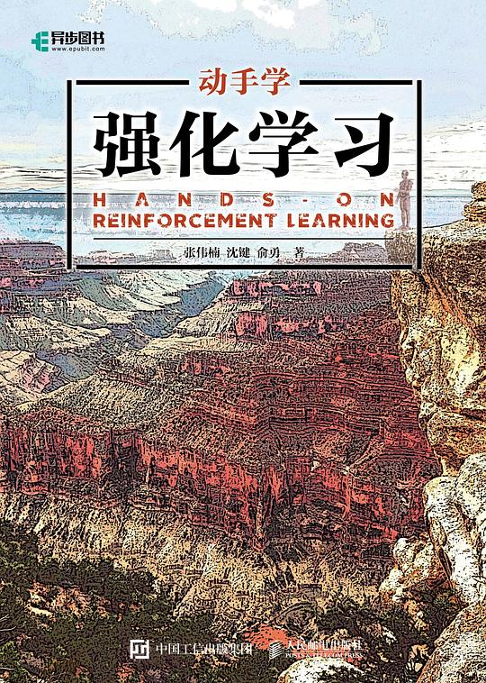

# 深度强化学习

深度强化学习参考下面两本资料进行学习即可：

- *深度强化学习*，王树森 著 

- *动手学强化学习*，张伟楠 沈键 俞勇著

*深度强化学习*主要介绍深度强化学习的基础知识，算法数学原理，可以用于理论学习。*动手学强化学习*侧重于深度学习算法的实现，在每一个算法的后面都有对应的`python`代码，十分适合初学者上手。

学习路径：

- 单智能体->多智能体
- 离散动作->连续动作

推荐的学习顺序：
::: tip
 DQN -> REINFORCE -> A2C -> PPO -> DDPG -> TD3 -> SAC
:::

## 经典算法一览

### 单智能体

- DQN系列算法
  - DQN
  - Double DQN
  - Dueling DQN
  - PER DQN
  - Noisy DQN
  - Distributional DQN
  - Rainbow
- DPG系列算法
  - DDPG
  - TD3
  - D4PG
- Policy Gradient系列算法
  - REINFORCE
  - Actor-Critic
  - A2C
  - A3C
- Trust Region系列算法
  - TRPO
  - PPO
- Maximum Entropy系列算法
  - SAC

### 多智能体

- MADDPG
- MAPPO
- HAPPO
- COMA
- QMIX